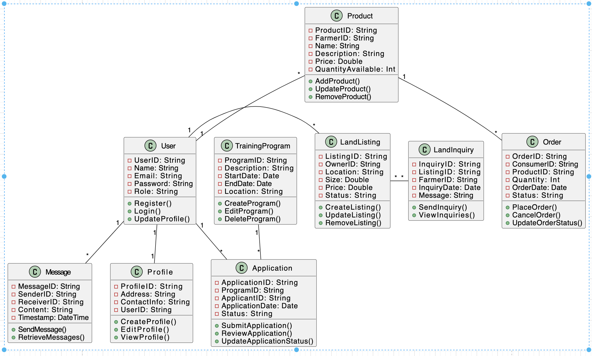
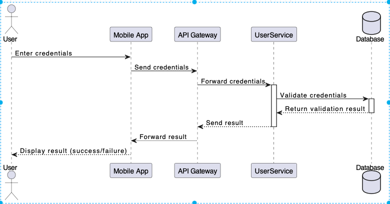
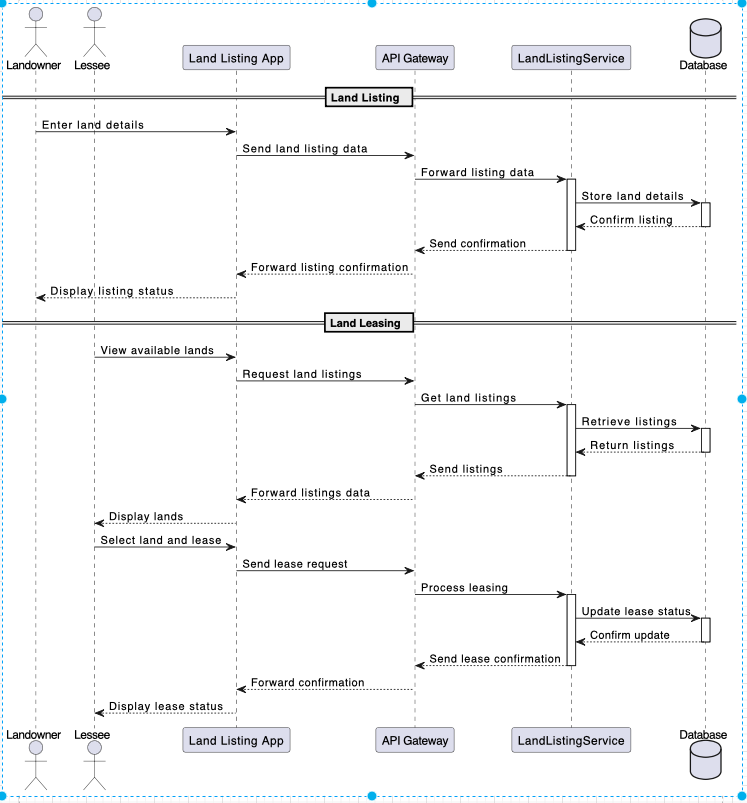

# local4809!


## Overview

Local4809 is a mobile application designed to revolutionize the way individuals interact with the agricultural sector. It aims to bridge the gap between farmers, landowners, and consumers by providing a platform for direct farm product purchases, land leasing, and agricultural training opportunities. This project is at the intersection of agriculture and technology, striving to enhance accessibility, efficiency, and education in the agricultural supply chain.

## Key Features

* User Registration and Profiles: Separate processes for consumers, farmers, and landowners.
* Land Listing and Inquiry: Allows landowners to list lands and farmers to inquire about leasing.
* Farm Equipment Leasing: Allows users to list and rent farm equipments

## Architectural Overview: Microservices
From an architectural point of view, we chose to use the microservices architecture design structure which involves developing a single application as a suite of small, independent services that run in their own processes and communicate with lightweight mechanisms, often through HTTP/API calls. 

### Architecture Diagram for Local4809


From the above diagram, we see that Local4809 has been developed in such a way that each microservice can be developed and scaled independent of the other because each one is a full standalone service having its own database.

#### Data Management
Database per Service: Each microservice has its own database, ensuring loose coupling and independent scalability.
Type of Database: Use of NoSQL databases like MongoDB for flexibility and scalability.

#### API Gateway
Acts as the single entry point for all clients (Web, Mobile).
Routes requests to the appropriate microservice.
Can handle cross-cutting concerns like authentication, logging, and micrservice interaction.

#### User Authentication and Authorization
OAuth2 and JWT: For secure authentication and authorization across services.
Centralized Identity Management: To manage user identities and roles across services.

#### Inter-Service Communication
RESTful APIs: For synchronous communication, especially for user-facing operations.
Messaging Queues (like RabbitMQ): For asynchronous communication between services, enhancing decoupling.

## Quality Attributes
* Scalability: This is one advantage of the microservice architecture, and it is one that efficiently handles increasing loads by scaling individual services as the needs arises, such as increasing loads on user signups or activity.
* Reliability: Robust error handling and service independence ensures consistent application performance. This also adds a level of resilience to the application as the failure of one service does not cause  a system-wide failure. It also supports the concept of reusability and maintainability by allowing the teams update or replace each independent service without impacting the entire system in anyway.
* Security: Emphasizes user data protection through secure API endpoints, encrypted authentication, and authorisation mechanisms.


#### Core Services in Local4809
* User Service: Handles user registration and profile management for consumers, farmers, and landowners.
* Land Listing Service: Manages the listing, viewing, and inquiring of available lands for lease.
* Equipment Listing Service: Facilitates communication between users.


### Class/model diagram for local4809



### Sequence Diagrams for local4809
A User logging into local4809 app




Land listing and landleasings



## Project/Folder Structure
We have choosen to use a monorepo approach for document all of our developmental efforts on this project. This means that all of our source codes would be based in this single repository. However, each microservice has been designated its own directory within the repository and can be developed completely independently from other services.

``````
  Local4809/app/backend
               |-- UserService/
               |-- LandListingService/
               |-- MessagingService/
               |-- TrainingApplicationService/
               |-- ...other services...
             /client
               |-- app/
               |-- web/
        /ReadME
        /...

``````

To streamline deployment efforts, we will be utilizing docker for containerisation of each service, docker compose or kubernetes for orchestration, and CI/CD pipelines for deployment purposes to Google cloud servers.

The data model for each service has been briefly highlighted below:


## Technologies

* Frontend: React Native for cross-platform mobile app development.
* Backend: Node.js with Express.js for building the server-side of the app.
* Database: MongoDB for storing user data, product listings, and land information.
* Authentication: JWT (JSON Web Tokens) for secure user authentication.
* APIs: RESTful APIs for frontend-backend communication.
* Version Control: Git for source code management, hosted on GitHub.

## Local Development/Environment Setup
#### Prerequisites:
- Ensure Docker and Docker Compose are installed on the development machine (for Docker Compose setup).
  Alternatively, for Kubernetes, ensure Minikube or any local Kubernetes cluster is set up.
#### Clone the Repository:
`````` git clone [repository URL] ``````
``````cd local4809 `````` 
#### Environment Setup:
 Configure necessary environment variables. This might involve setting up a .env file or configuring variables directly in Docker Compose or Kubernetes manifests.
#### Running with Docker Compose (if using Docker Compose):
`````` docker-compose up ``````
 This command will start all services defined in the docker-compose.yml file.

#### Running with Kubernetes (if using Kubernetes):
Start the local Kubernetes cluster (e.g., using Minikube).
Apply your Kubernetes manifests:
``````kubectl apply -f <kubernetes-manifest-file.yml>``````
This will set up your services, deployments, and any necessary resources like load balancers.

## For Production Deployment:
#### Prerequisites:
- Access to the cloud environment where Kubernetes cluster or Docker Swarm is hosted.
- Necessary permissions to deploy and manage resources.(request permissions here)
#### CI/CD Pipeline:
 CI/CD pipeline is configured to deploy the latest changes to our cloud environment.

#### Manual Deployment (if necessary):
Similar to the local Kubernetes setup, apply your manifests to the cloud Kubernetes cluster.
For Docker Swarm, deploy your stack using the relevant Docker commands.

* Launch the React Native App:
Ensure you have the React Native environment set up.
* Start the app:
- - `npm start`
Follow on-screen instructions to run the app on iOS/Android simulators or real devices.
* Database Setup:
Set up a MongoDB instance and connect it using the provided URI in environment variables.

## Contribution and Collaboration

Contributions to Local4809 are welcome. Please read the contribution guidelines before submitting your proposals.
For collaboration or inquiries, please contact the project maintainers via [contact information].

## Future Development Plans

Regular updates will be made to this repository as the project progresses.
Detailed documentation and additional features will be added in line with the project roadmap.